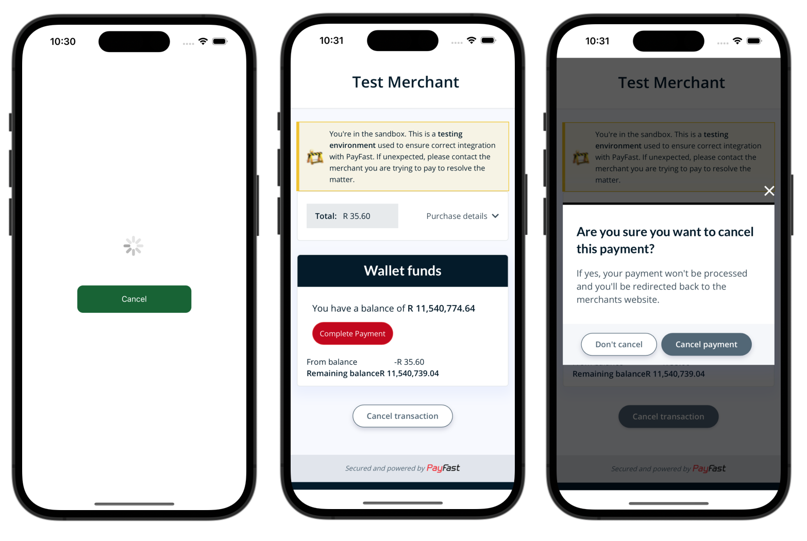

# react-native-payfast-checkout

This is a React Native package for integration of Payfast payment gateway into your React Native projects. The package is also compatible with React Native Expo.



## Features

- Make once off or repeat payments using a bank card e.g Cheque or Credit Card
- Save bank card for future use (Tokenization), token sent to your notifyUrl
- Update saved bank card details
- Hook/Function to make a payment with saved card / token

## Upcoming Features

- Recurring Billing / Subscriptions

## About the package

- Make a once off payment for any product/service within the app
- Easy to use package for integrating Payfast payment gateway into your React Native app
- Written in TypeScript, providing type definitions and improved developer experience
- Compatible with React Native & React Native Expo

## Props

### Paystack Props

| Prop               | Type     | Description                                   | Required | Default Value |
| ------------------ | -------- | --------------------------------------------- | -------- | ------------- |
| paymentMethod      | String   | See below                                     | Yes      | cc            |
| transactionDetails | Object   | See below                                     | Yes      | N/A           |
| notifyUrl          | String   | Webhook url for outcome notification          | No       | N/A           |
| sandbox            | Boolean  | Used to set the integration into testing mode | Yes      | false         |
| signature          | Boolean  | Whether to to use singature or not            | Yes      | false         |
| merchantId         | String   | Payfast merchant Id                           | Yes      | N/A           |
| merchantKey        | String   | Payfast merchant key                          | Yes      | N/A           |
| isVisible          | Boolean  | Whether to show the payment window or not     | Yes      | N/A           |
| passPhrase         | String   | Phrase to secure the payload                  | Yes      | N/A           |
| onClose            | Function | Function to close the payment window          | Yes      | N/A           |

### Payment Method

When this field is set, only the SINGLE payment method specified can be used when the customer reaches Payfast. If this field is blank, or not included, then all available payment methods will be shown

Options
| Option | Description|
|--------|------------|
|eft | EFT|
|cc | Credit card|
|dc | Debit card|
|mp | Masterpass Scan to Pay|
|mc | Mobicred|
|sc | SCode|
|ss | SnapScan|
|zp | Zapper|
|mt | MoreTyme|
|rcs| Store card|

### Transaction Details

| Name                 | Type   | Description                               | Required |
| -------------------- | ------ | ----------------------------------------- | -------- |
| customerFirstName    | String | Customer First Name                       | No       |
| customerLastName     | String | Customer Last Name                        | No       |
| customerEmailAddress | String | Customer Email address                    | No       |
| customerPhoneNumber  | String | Customer Phone Number                     | No       |
| reference            | String | Transaction Reference                     | No       |
| amount               | Float  | Transaction Amount in South African Rands | Yes      |
| itemName             | String | Name of item being paid for               | Yes      |
| itemDescription      | String | Description of the item being paid for    | No       |

## How to use the package

Install the latest version of the package
Using Yarn

```bash
yarn add react-native-payfast-checkout
```

or Npm

```bash
npm install react-native-payfast-checkout
```

or Expo

```bash
npx expo install react-native-payfast-checkout
```

Use the package in your cart or checkout screen

```tsx
...
import Payfast from 'react-native-payfast-checkout'
...
const CartScreen = () => {
    ...
    const [showPayfast, setShowPayfast] = useState(false)
    ...
    const transactionDetails = {
        itemName:'iPhone',
        amount: 1500.25
    }
    return <View>
    ...
    <PayFast
        merchantId={process.env.PAYFAST_MERCHANT_ID}
        merchantKey={process.env.PAYFAST_MERCHANT_KEY}
        passPhrase={process.env.PAYFAST_SIGNATURE_PHRASE}
        sandbox
        isVisible={showPayfast}
        onClose={() => setShowPayfast(false)}
        transactionDetails={transactionDetails}
      />
    ...
    </View>
}

export default CartScreen
```

Adding saving a card for future use

Unfortunately Payfast does not return any details for your saved card, except for the token, therefore you can't show the last 4 digits for the user to remember the card they saved, but the update card screen shows the last 4 digits and the expiry date

```tsx
import {PayFastSaveCard} from 'react-native-payfast-checkout'
...
const PaymentOptionsScreen = () => {

    const [showAddCard, setShowAddCard] = useState(false)
    const [showUpdateCard, setShowUpdateCard] = useState(false)

    const transactionDetails = {
        customerFirstName: 'John',
        customerLastName: 'Doe',
        customerEmailAddress: 'name@email.com',
    }

    return <View>
    ...
    <PayFastSaveCard
        transactionDetails={transactionDetails}
        merchantId={process.env.PAYFAST_MERCHANT_ID}
        merchantKey={process.env.PAYFAST_MERCHANT_KEY}
        passPhrase={process.env.PAYFAST_SIGNATURE_PHRASE}
        notifyUrl=''
        isVisible={showAddCard}
        onClose={(isDone) => {
            // Do things here then
            setShowAddCard(false)
        }}
    />
    ...
    <PayFastUpdateCard
        cardToken=''
        isVisible={showUpdateCard}
        sandbox
        onClose={() => {
            // Do things here
            setShowUpdateCard(false)
        }}
    />
    ...
    </View>
}

export default PaymentOptionsScreen
```

### Official Documentation

For more details you can visit the official Payfast [documentation page](https://developers.payfast.co.za/docs#home)

